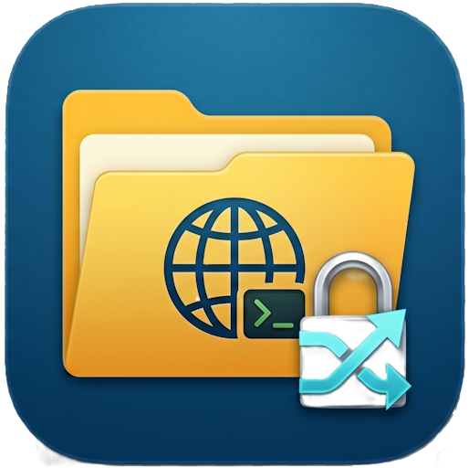
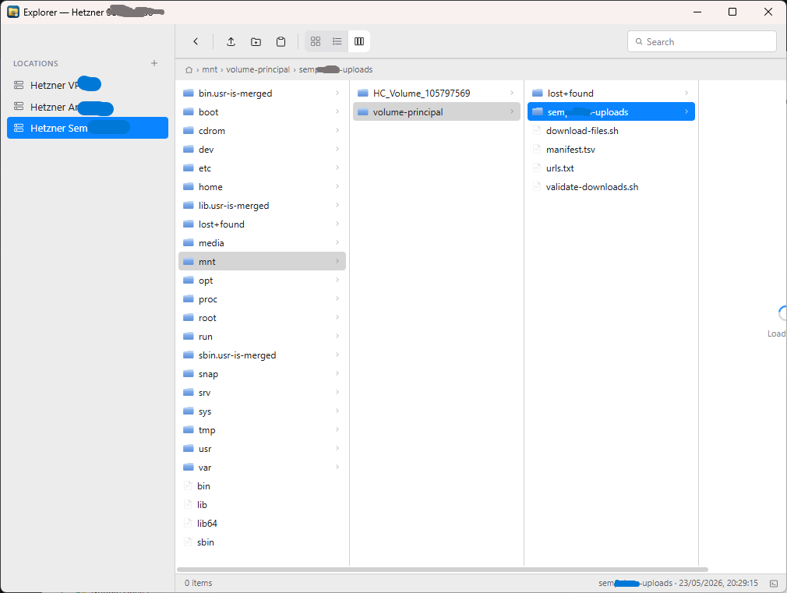
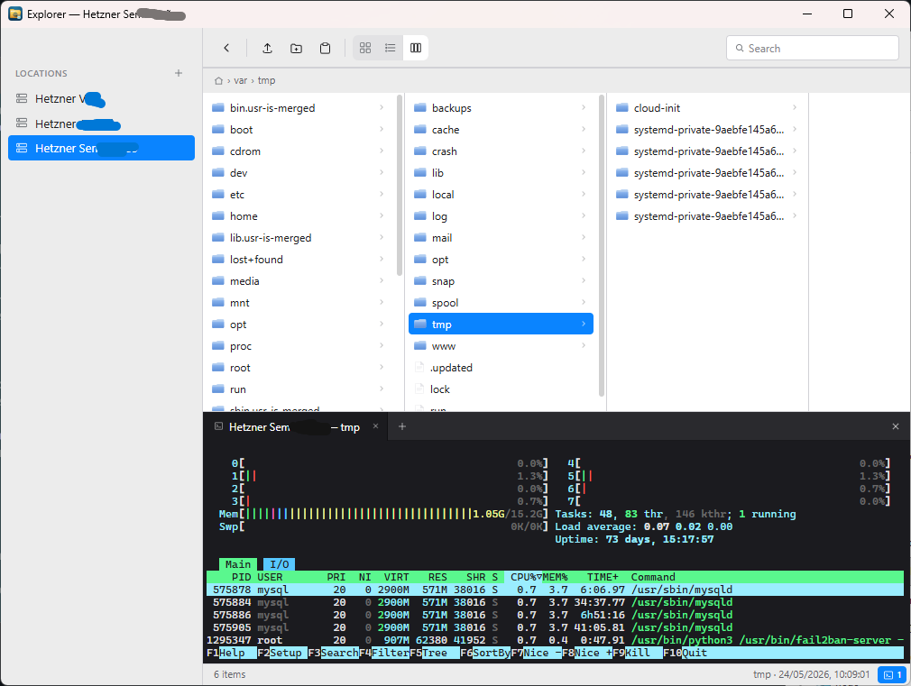
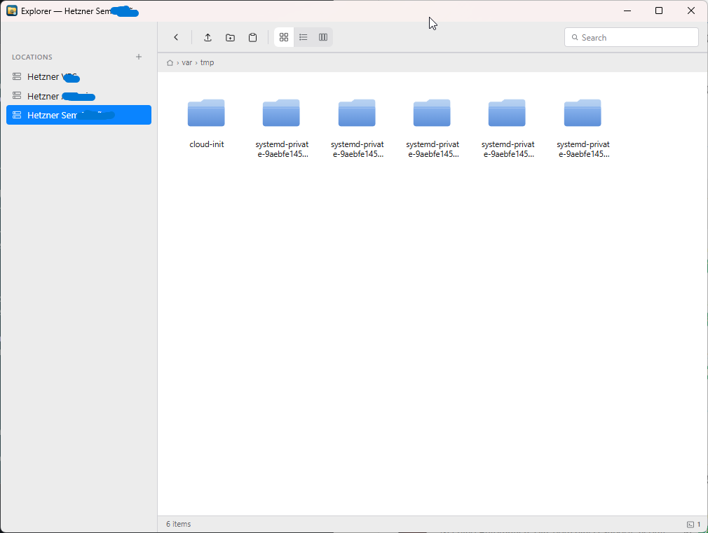

<div align="center">
  
  <h1>ST Explorer</h1>
  <p><strong>A native SFTP client for Windows with a Finder-style UI, integrated SSH terminal, and modern UX.</strong></p>
  <p>
    <a href="#features">Features</a> •
    <a href="#getting-started">Getting started</a> •
    <a href="#building-from-source">Build</a> •
    <a href="#keyboard-shortcuts">Shortcuts</a> •
    <a href="#security">Security</a> •
    <a href="#technical-context--roadmap">Roadmap</a>
  </p>
</div>

---

ST Explorer browses remote SFTP servers like the local file system — drag-and-drop uploads, system-clipboard paste from Windows Explorer, an inline SSH terminal with tabs, and a column view inspired by macOS Finder.

Built with [Wails](https://wails.io) (Go backend, React frontend). Compiles to a single ~12 MB native `.exe` — no Electron, no bundled Chromium.

## Features

**File browsing**
- Three view modes: **Icons**, **List**, and **Columns** (Finder-style Miller columns with drill-down).
- Sortable columns, instant filtering, breadcrumb navigation with clickable segments.
- Per-column loading indicators so navigation never feels frozen.
- Folder operations: create, rename, delete (recursive), move, copy (including directory trees).

**Transfers**
- Drag-and-drop files from Windows Explorer straight into the current directory.
- Paste from system clipboard: `Ctrl+C` on a file in Windows Explorer → `Ctrl+V` in the app uploads it.
- Internal cut/copy/paste with server-side SFTP copy (no round-trip through your machine).
- Live transfer panel with progress bars for every upload/download/copy.

**SSH terminal**
- Click the terminal icon in the status bar to open an SSH shell rooted at your current directory.
- Multiple terminals as tabs on the same connection.
- Powered by [xterm.js](https://xtermjs.org) with a dark theme and full ANSI/256-color support.

**Authentication**
- Password or SSH private key (OpenSSH/PEM format, encrypted or unencrypted).
- Server CRUD in the UI — no manual JSON editing required.
- Host key verification using **trust-on-first-use** (`known_hosts` stored in `%APPDATA%/Explorer/`).

**UX polish**
- macOS Finder–inspired interface: light chrome, SVG icons, system font stack, soft selections.
- Keyboard shortcuts for everything that matters.
- Window title reflects the active connection.
- Modal dialogs for prompts/confirmations (no native browser popups).

## Screenshots

<p align="center">
  
  <br />
  <em>Finder-style column view — drill into deep trees without losing context.</em>
</p>

<p align="center">
  
  <br />
  <em>Built-in SSH terminal, tabs included. Drops you straight into the folder you're browsing.</em>
</p>

<p align="center">
  
  <br />
  <em>Icons view for visual scanning. List and Columns views also available — toggle from the toolbar.</em>
</p>

See the full feature tour at <a href="https://stexplorer.stivetec.com">stexplorer.stivetec.com</a>.

## Getting started

### Download

Grab the latest release from the [Releases page](../../releases) and run `STExplorer.exe`. No installer needed.

### First run

1. Click the **+** next to **Locations** in the sidebar.
2. Fill in the server details. Pick **Password** or **SSH key** auth.
3. Save, then click the server to connect.
4. The host key is recorded on first connect (TOFU); any future mismatch will refuse the connection.

Your server list is stored in `servers.json` next to the executable.

## Building from source

### Requirements

- [Go](https://go.dev/dl/) 1.25 or newer
- [Node.js](https://nodejs.org/) 18+ and npm
- [Wails CLI](https://wails.io/docs/gettingstarted/installation): `go install github.com/wailsapp/wails/v2/cmd/wails@latest`

### Build a release `.exe`

```powershell
git clone https://github.com/<your-user>/STExplorer.git
cd STExplorer
.\build.bat
```

The executable lands at `build\bin\STExplorer.exe`.

### Run in dev mode (hot reload)

```powershell
wails dev
```

## Keyboard shortcuts

| Action | Shortcut |
|---|---|
| Back / collapse column | `Backspace` |
| Open file / enter folder | `Enter` (or double-click) |
| Rename | `F2` |
| Delete | `Del` |
| Copy | `Ctrl+C` |
| Cut | `Ctrl+X` |
| Paste (internal or system clipboard) | `Ctrl+V` |

## Security

- **Credentials at rest** — passwords and key passphrases in `servers.json` are encrypted before being written to disk. On Windows the encryption uses **DPAPI** (`CryptProtectData`), which binds the ciphertext to your Windows user account — even an attacker with the file can't decrypt it without your login session. On macOS / Linux the app falls back to AES-256-GCM with a per-user key file kept at `~/.config/Explorer/key` (0600). Legacy plaintext entries from older versions are migrated automatically the first time you launch.
- **Host keys** are pinned via `known_hosts`. The first connection trusts the key automatically; subsequent connections refuse if the key changes (potential MITM).
- **Clipboard** integration only reads file paths the user explicitly copies (no background polling).
- **No telemetry**, no auto-update calls, no network traffic except to the SFTP servers you configure.

If you find a security issue, please open a private security advisory rather than a public issue.

## Technical Context & Roadmap

This project is a technical laboratory for exploring native integrations with Wails and Go. As such, some architectural decisions are ongoing experiments.

### Known Technical Debt
- **Config Storage:** Currently uses `servers.json` in the working directory. Planned migration to `os.UserConfigDir()` for better OS compliance.
- **Cross-Platform Secrets:** Secure persistence is fully native on Windows (DPAPI). Support for macOS Keychain and Linux Secret Service is on the roadmap.
- **Error Granularity:** Operations like recursive delete and tree copy currently use simplified error handling. Improving partial failure reporting is a priority.

### Roadmap
- [ ] Support for Jump Hosts / SSH Tunneling.
- [ ] Integration with macOS Keychain.
- [ ] Background sync/queue for large transfers.
- [ ] Folder bookmarks/favorites.

## Platform support

| Platform | Status |
|---|---|
| Windows 10 / 11 | Fully supported |
| macOS | Should build via Wails; clipboard paste from Finder not yet implemented |
| Linux | Should build via Wails; clipboard paste from file managers not yet implemented |

The drag-and-drop and SSH terminal features are cross-platform. Only the system-clipboard file paste relies on Windows-specific APIs (`CF_HDROP`).

## Tech stack

- **Backend**: Go, [pkg/sftp](https://github.com/pkg/sftp), [golang.org/x/crypto/ssh](https://pkg.go.dev/golang.org/x/crypto/ssh)
- **Frontend**: React 18, Tailwind CSS, [xterm.js](https://xtermjs.org)
- **Framework**: [Wails v2](https://wails.io) (WebView2 on Windows)

## Contributing

Pull requests welcome. For non-trivial changes, please open an issue first to discuss what you'd like to change.

Code style:
- Go: `gofmt` clean, no comments unless they explain a non-obvious *why*.
- JavaScript: 4-space indent, functional React, no class components.

## License

MIT — see [LICENSE](LICENSE).

## Acknowledgements

- The [Wails](https://wails.io) team for a fantastic Go + web framework.
- macOS Finder for the column-view paradigm.
- The Hetzner Storage Box that survived the testing of this code.
